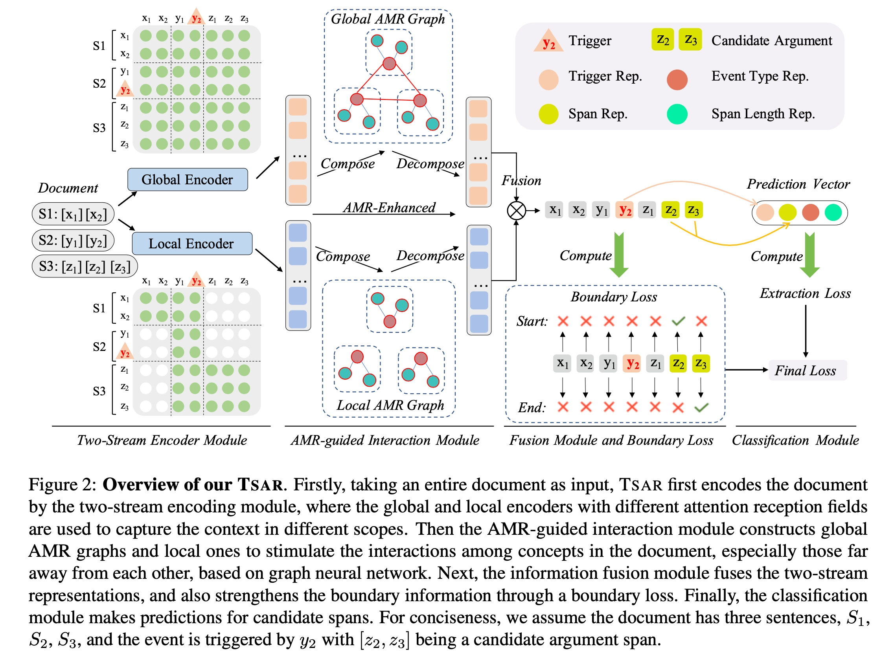

# TSAR

Source code for NAACL 2022 paper: [A Two-Stream AMR-enhanced Model for Document-level Event Argument Extraction]().

## 🔥 Introduction

We focus on extracting event arguments from an entire document, which mainly faces two critical problems: a) the long-distance dependency between trigger and arguments over sentences; b) the distracting context towards an event in the document. To address these issues, we propose a Two-Stream Abstract meaning Representation enhanced extraction model (TSAR). TSAR encodes the document from different perspectives by a two-stream encoding module, to utilize local and global information and lower the impact of distracting context. Besides, TSAR introduces an AMR-guided interaction module to capture both intra-sentential and inter-sentential features, based on the locally and globally constructed AMR semantic graphs. An auxiliary boundary loss is introduced to enhance the boundary information for text spans explicitly. 
You can refer to our [paper]() for more details.

<div align=center>

</div>


## 🚀 How to use our code?

### 1. Dependencies

- pytorch==1.9.0
- transformers==4.8.1
- datasets==1.8.0
- dgl-cu111==0.6.1
- tqdm==4.49.0
- spacy==3.2.4

For the usage of spacy, the following command could be helpful.

```bash
>> pip install https://github.com/explosion/spacy-models/releases/download en_core_web_sm-3.2.0/en_core_web_sm-3.2.0.tar.gz
```

### 2. Data Preprocessing

You can first download the datasets and some scripts [here](https://drive.google.com/file/d/1euuD7ST94b5smaUFo6ROLW_ZasHwDpib/view?usp=sharing).
You only need to unzip the data.zip.

Then Go to [data/wikievents](./data/wikievents) folder and run the following command, which is used to transfer the data formats.

```bash
>> python transfer.py
```

Then we parse the AMR results for our data. 
Please refer to [here](https://github.com/zhangzx-uiuc/AMR-IE).
We use exactly the same AMR parser.
After you have successfully installed the parser, you can simply run the following command in the [transition-amr-parser](./transition-amr-parser) folder.

```bash
>> python amrparse.py
```

Then we transfer preprocess for DGL graph by the following script.

```bash
>> python amr2dglgraph.py
```

We also directly provide the data [here]() (coming soon).
In this way, you can just skip the AMR and DGL graph preprocessing steps.

### 3. Training and Evaluation

The training scripts are provided.

```bash
>> bash run_rams_base.sh
>> bash run_rams_large.sh
>> bash run_wikievents_base.sh
>> bash run_wikievents_large.sh
```

You can change the settings in the corresponding scripts.

And you can evaluate the model by the following scripts.

```bash
>> bash evaluate_rams.sh
>> bash evaluate_wikievent.sh
```


## 🌝 Citation

If you use this work or code, please kindly cite the following paper:

```bib
@inproceedings{xu-etal-2022-tsar,
    title = "A Two-Stream AMR-enhanced Model for Document-level Event Argument Extraction",
    author = "Runxin Xu and Peiyi Wang 
    and Tianyu Liu and Shuang Zeng
    and Baobao Chang and Zhifang Sui",
    booktitle = "Proceedings of the 2022 Conference of the North American Chapter of the Association for Computational Linguistics (NAACL).",
    year = "2022"
}
```
